# 智能酒店食宿系统/酒店系统
**基于 SpringBoot 和 Vue 进行开发
联系作者：upunstop@163.com**

## 项目简介
​	智能酒店食宿系统旨在提供一种高效、便捷的酒店预订和管理方式。用户可以轻松地查找并预订符合自己需求的房间、餐饮和服务项目，同时享受到更加个性化的服务体验。管理端则提供了强大的数据分析和管理功能，帮助酒店管理者精准把握市场动态和客户需求，并优化服务质量。
## 系统功能
- 站点管理
  - 轮播图管理
  - 公告栏管理
- 用户管理
  - 管理员管理
  - 普通用户管理
- 内容管理
  - 交流论坛
  - 论坛分类列表
  - 酒店资讯
  - 新闻分类列表
- 酒店管理
  - 酒店菜品
  - 菜品下单
  - 酒店酒水
  - 酒水下单
  - 酒店房间
  - 房间预定
  - 酒店餐桌
  - 餐桌预约
  - 餐桌预约详情
  - 餐桌预约编辑

## 技术栈

前端：

- Vue.js：使用了`vue`作为主要的JavaScript框架。
- Element UI：使用了`element-ui`作为UI组件库，用于构建用户界面。
- Vue Router：使用了`vue-router`进行前端路由管理。
- Vuex：使用了`vuex`进行状态管理。
- Axios：使用了`axios`进行HTTP请求。
- Vue Quill Editor：使用了`vue-quill-editor`作为富文本编辑器。
- jQuery：使用了`jquery`进行DOM操作和事件处理。
- Core-js：使用了`core-js`来提供JavaScript的Polyfill支持。
- Register Service Worker：使用了`register-service-worker`来注册Service Worker，实现渐进式Web应用（PWA）功能。

后端：

- Spring Boot：使用了`spring-boot-starter-web`和`spring-boot-starter`来构建Web应用程序。
- Spring Data JPA：使用了`spring-boot-starter-data-jpa`来简化与数据库的交互。
- MySQL：使用了`mysql-connector-java`作为MySQL数据库的驱动。
- MyBatis Plus：使用了`mybatis-plus`来简化MyBatis的配置和使用。
- Lombok：使用了`lombok`来简化实体类的编写。
- Fastjson：使用了`fastjson`作为JSON处理工具。
- Apache POI：使用了`poi-ooxml`来处理Microsoft Office格式的文件。
- Spring Boot Test：使用了`spring-boot-starter-test`进行单元测试。

## 项目截图

### 用户端
首页


公告栏


酒店资讯


酒店菜品推荐


酒店酒水推荐


酒店房间推荐


酒店菜品列表


酒店资讯列表
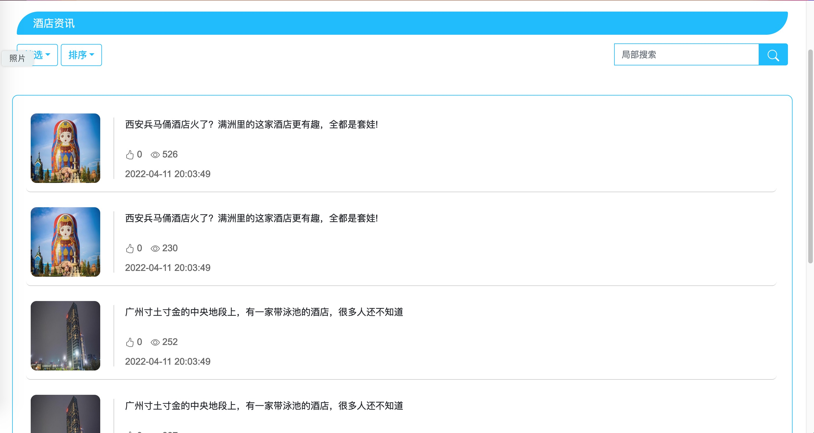

酒店酒水列表


酒店房间列表


酒店餐桌列表


交流论坛


公告信息
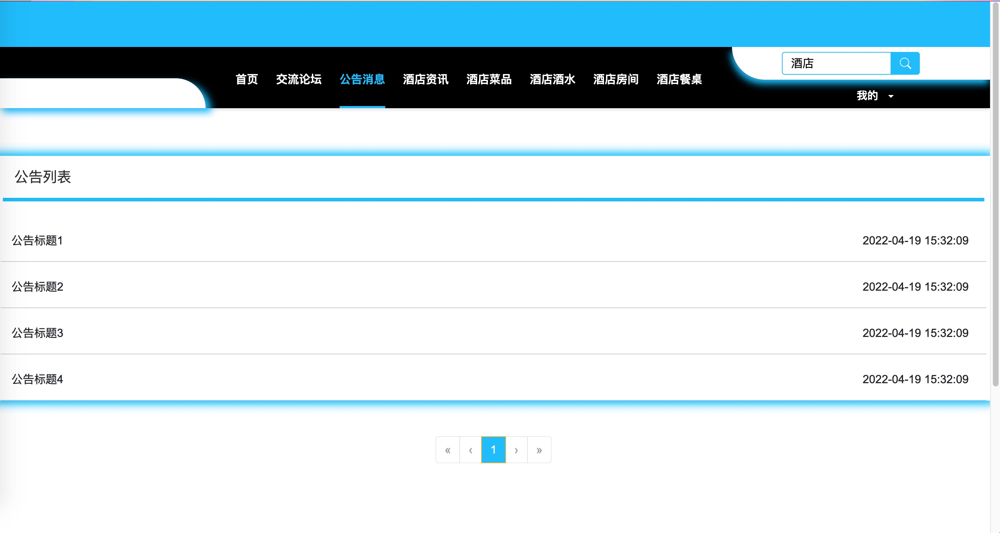

个人信息
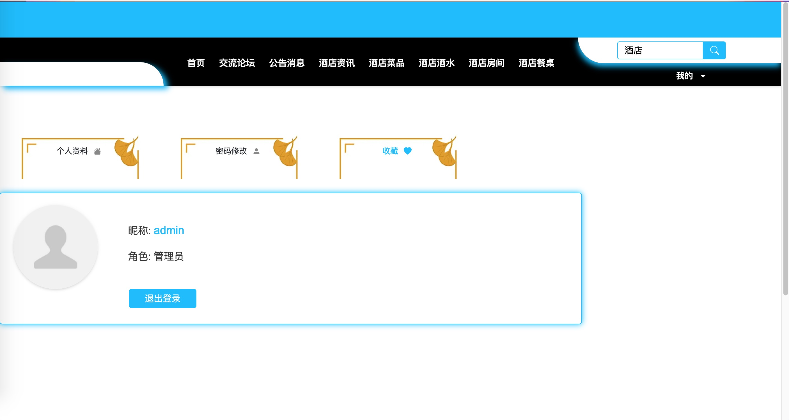

酒店资讯详情


文章编辑
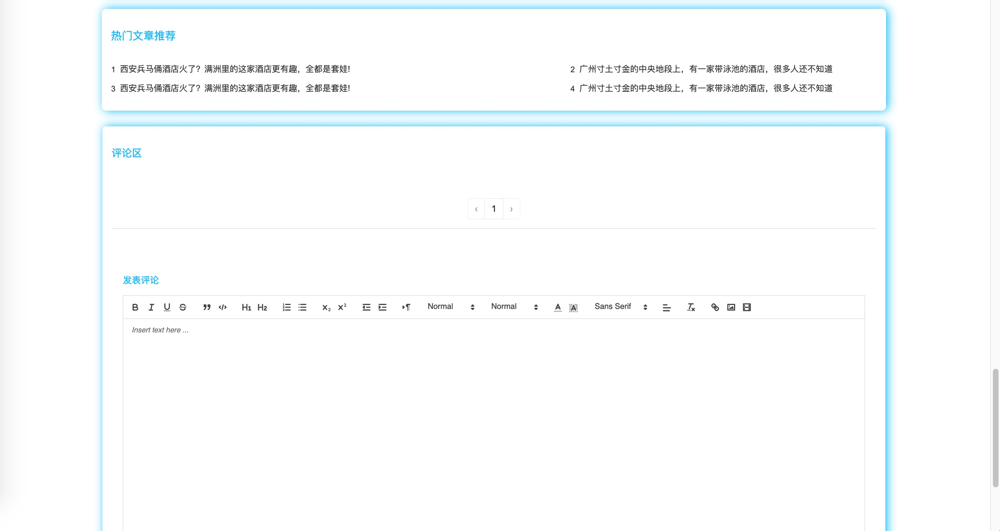

菜品详情
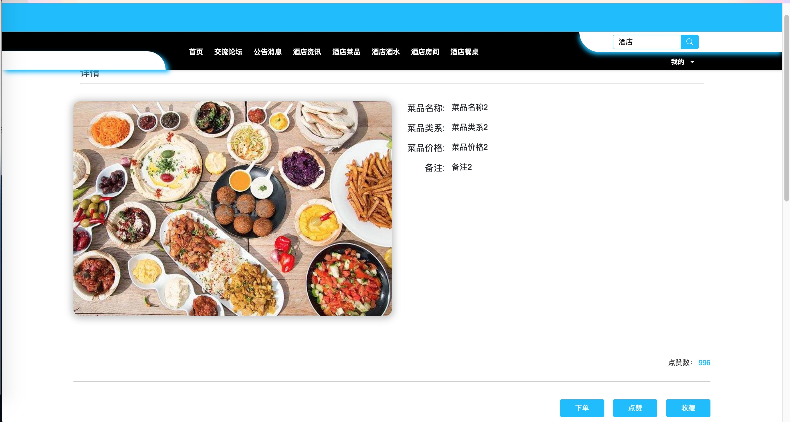

点赞👍


收藏🌟
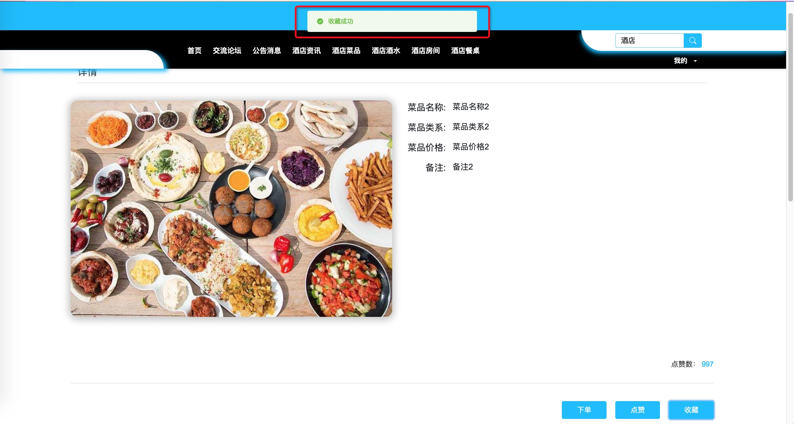

收藏列表
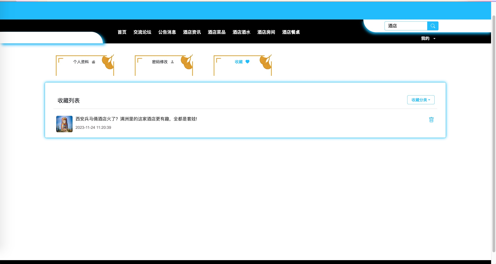

### 管理端
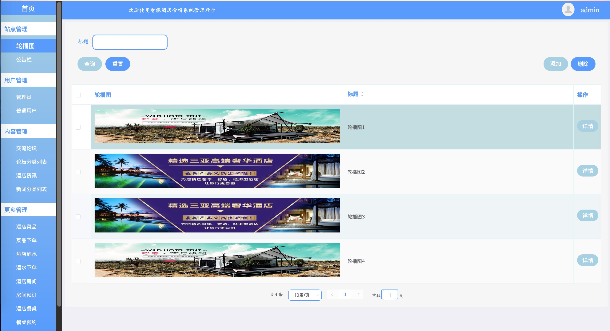
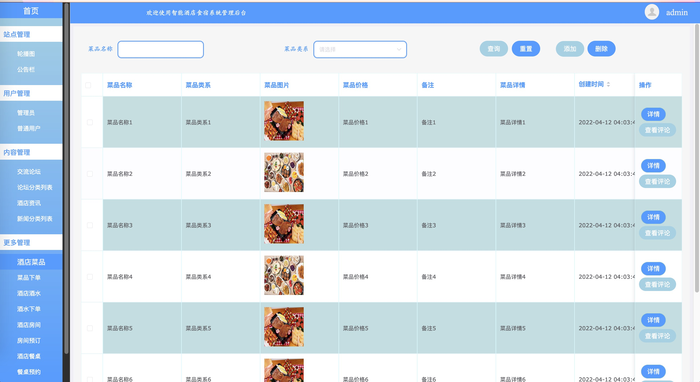
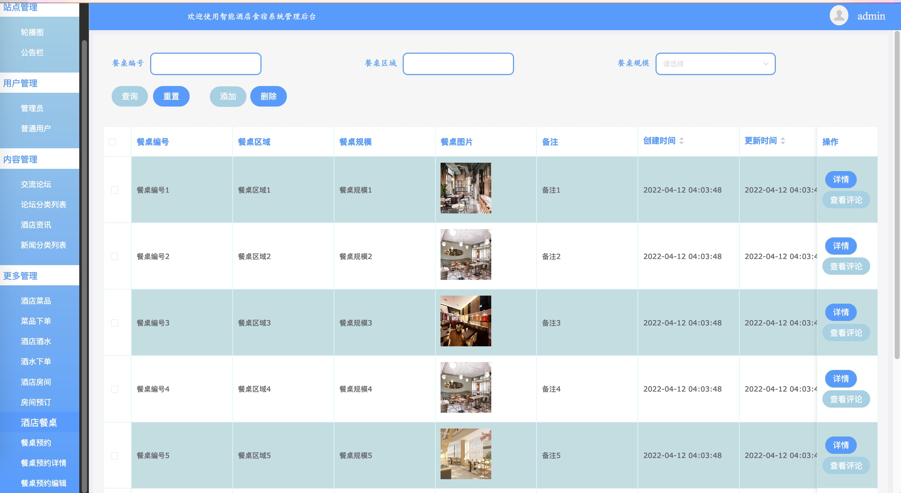
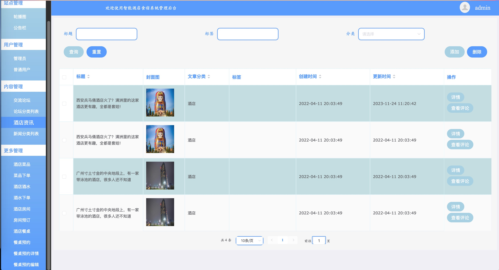


## 使用教程
### 后端

1. IDEA打开项目
2. 安装并新建MySQL（版本5.7.x或以上）数据库，导入 **SQL** 文件
3. 修改数据库配置，等待Maven下载依赖
4. 启动 backend 项目

### 前端

1. 安装node.js「我的是16.19.1版本」
2. 分别切换到 client_admin 和 client_home 文件夹下

```bash
# 安装yarn
npm install -g yarn

# 下载依赖
yarn install

# 分别启动client_admin 和 clinet_home
npm run dev
npm run serve
```
